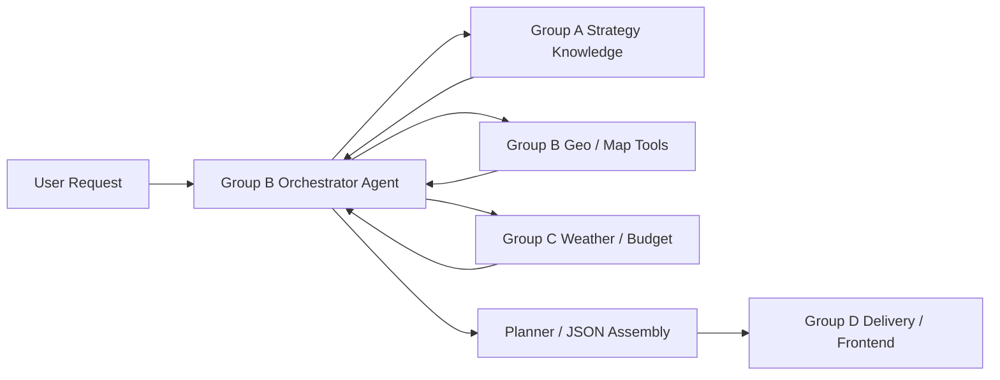

# Agent Orchestration Playbook

## Your Role

The agent owned by Group B should act as the **orchestrator**, not as the source of every fact.

Its responsibilities are:

1. Parse the user request into a normalized trip profile.
2. Decompose complex multi-part questions into simpler subtasks.
3. Ask upstream teams or tools for missing knowledge.
4. Standardize all returned data into one internal schema.
5. Produce the final `itinerary JSON`.
6. Hand the JSON to the delivery / frontend team.

In one sentence:

`User request -> orchestrator agent -> A/C/B data collection -> normalized context -> itinerary JSON -> D group`

## Team Interface Model

### Group A: Strategy / Content Knowledge

Group A should answer questions such as:

- Which POIs match the travel style?
- What local pitfalls or neighborhood suggestions matter?
- Which spots are parent-child friendly, food-focused, or culture-focused?

Recommended contract:

```json
{
  "recommended_pois": ["Chengdu Research Base of Giant Panda Breeding", "Kuanzhai Alley"],
  "theme_suggestions": ["family", "slow urban exploration"],
  "local_pitfalls": ["Avoid peak panda-base arrival after 10am"],
  "neighborhood_notes": [
    {
      "district": "Qingyang",
      "note": "Good cluster for relaxed walking and local snacks."
    }
  ]
}
```

### Group B: Geo / Routing / POI Normalization

This is the part your own agent can do locally with map tools:

- normalize POI names
- fetch coordinates
- identify district / area
- estimate routing coherence
- collect address, hours, ticket price

Recommended contract:

```json
{
  "results": [
    {
      "name": "Chengdu Research Base of Giant Panda Breeding",
      "lat": 30.733,
      "lon": 104.151,
      "district": "Chenghua",
      "address": "1375 Xiongmao Ave, Chenghua",
      "open_hours": "07:30-18:00",
      "ticket_price": 55
    }
  ]
}
```

### Group C: Weather / Budget / Conditions

Group C should provide trip-window constraints:

- daily weather
- price assumptions
- budget envelope
- travel-day warnings

Recommended contract:

```json
{
  "daily_weather": [
    {
      "date": "2026-05-01",
      "summary": "Cloudy",
      "outdoor_suitability": "mixed"
    }
  ],
  "budget_summary": {
    "budget_level": "medium",
    "estimated_daily_spend": 450
  },
  "pricing_notes": ["Holiday surge expected around major attractions."]
}
```

## What The Agent Should Output

The core deliverable is not a paragraph. It is a final `itinerary JSON`.

Minimum structure:

```json
{
  "city": "Chengdu",
  "trip_days": 3,
  "overview": "A 3-day family itinerary in Chengdu with a balanced pace and medium budget profile.",
  "total_estimated_cost": 320,
  "selected_pois": [],
  "days": [],
  "planning_notes": [],
  "local_tips": []
}
```

This is the JSON that should be handed to the downstream delivery team.

## Orchestrator Flow



## Recommended Internal Pipeline

1. Build `user_profile`.
2. If this is a follow-up turn, merge the new instruction into remembered `preference_memory`.
3. Decompose the request into `strategy`, `geo`, and `conditions` subtasks.
4. Generate focused query candidates from must-visit items, interests, and notes.
5. Request strategy content from Group A.
6. Request normalized POIs and routing facts from map tools.
7. Request weather and budget context from Group C.
8. Merge the above into one internal context object.
9. Generate the itinerary draft JSON.
10. Run a review stage for pace, weather fit, budget pressure, and route coherence.
11. Output the final itinerary JSON.
12. Optionally render a markdown report for human readability.

## Single-Agent Context Management

If you keep only one agent, do not dump the full chat history back into every prompt. Manage context in layers:

1. `preference_memory`: durable user preferences such as city, trip days, budget, pace, interests, must-visit, and avoid.
2. `current_turn_request`: only the new delta from this turn.
3. `decomposition`: focused subtasks for A / map / C modules.
4. `collected_context`: retrieved strategy, geo, weather, and budget facts.
5. `itinerary_json`: the latest executable plan.

In this project, `start_conversation()` and `continue_conversation()` keep the remembered profile in memory, then re-run decomposition and planning from the merged profile.

## Implementation Mapping In This Project

In the current codebase:

- `TravelPlanningAgent.run()` returns the normal report + plan.
- `TravelPlanningAgent.run_orchestrated()` returns the orchestration bundle for team-style integration.

The orchestration bundle includes:

- `user_profile`
- `decomposition`
- `upstream_requests`
- `collected_context`
- `itinerary_json`
- `report`
- `tool_logs`

## Why This Design Is Better

- It matches the real team split.
- It makes integration easier.
- It prevents the agent from hallucinating data it should have fetched.
- It makes your contribution clearly visible in the architecture.
- It gives you a clean answer when the professor asks: "What exactly does the agent do?"

## One-Sentence Answer For Presentation

`Our agent is the orchestration layer: it collects strategy knowledge, geo facts, and trip conditions from different modules, standardizes them, and outputs the final itinerary JSON for downstream delivery.`
